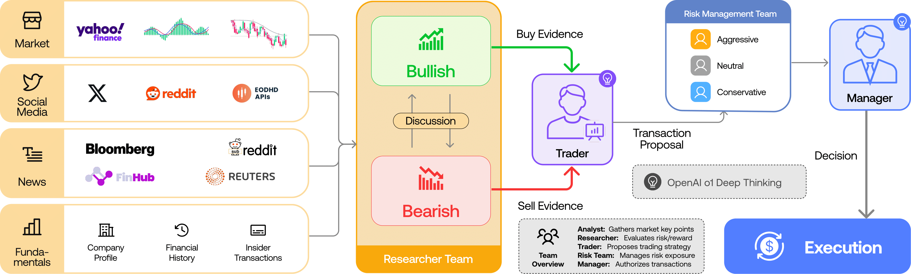

<p align="center">
  
</p>

<div align="center" style="line-height: 1;">
  <a href="https://arxiv.org/abs/2412.20138" target="_blank"></a>
  <a href="https://discord.com/invite/hk9PGKShPK" target="_blank"></a>
  <a href="https://x.com/TauricResearch" target="_blank"></a>
  <a href="https://github.com/TauricResearch/" target="_blank"></a>
</div>

---

# TradingAgents × Claude Code: Multi-Agent Trading Research, No API Keys

> **This fork is a full rewrite of [TradingAgents](https://github.com/TauricResearch/TradingAgents) that runs natively on [Claude Code](https://claude.com/claude-code).** The LangGraph pipeline, the LLM provider clients, and every API-key requirement are gone. Claude Code itself is the reasoning engine: each agent role is a Claude Code subagent, the pipeline is a skill, and the Python package has been reduced to a keyless market-data backend.

```bash
git clone <this repo> && cd tradingagents
python3 -m venv .venv && .venv/bin/pip install -e .   # needs Python 3.10+: use e.g. python3.12 if python3 is older
claude
```

```
/tradingagents NVDA
```

That's the whole setup. No `OPENAI_API_KEY`, no `ANTHROPIC_API_KEY`, no model
picking — your Claude Code subscription powers every agent, and all market data
comes from free sources (Yahoo Finance, Reddit, StockTwits, Polymarket; FRED
and Alpha Vantage optional).

## What it does

TradingAgents mirrors the dynamics of a real-world trading firm. Specialized
agents — fundamental, sentiment, news, and technical analysts, bull/bear
researchers, a trader, a risk-management trio, and a portfolio manager —
collaboratively evaluate a ticker and produce a rated trading decision through
structured debate.

<p align="center">
  
</p>

> TradingAgents is designed for research purposes. Trading performance may vary
> based on many factors, including the backbone model, trading periods, data
> quality, and other non-deterministic factors.
> [It is not intended as financial, investment, or trading advice.](https://tauric.ai/disclaimer/)

### The pipeline

1. **Analyst Team** (runs in parallel)
   - *Market Analyst* — picks up to 8 technical indicators (MACD, RSI,
     Bollinger, …), grounds every exact number in a verified data snapshot.
   - *Sentiment Analyst* — reads a pre-fetched bundle of news headlines,
     StockTwits messages, and Reddit threads; emits a banded sentiment score.
   - *News Analyst* — ticker news, global macro headlines, FRED macro series,
     Polymarket market-implied probabilities, insider transactions.
   - *Fundamentals Analyst* — company overview, balance sheet, cash flow,
     income statement (skipped automatically for crypto).
2. **Research Team** — Bull and Bear researchers debate over the analyst
   reports (1–5 rounds); the Research Manager judges the debate and issues an
   investment plan on the 5-tier scale.
3. **Trader** — turns the plan into a concrete Buy/Hold/Sell proposal with
   optional entry, stop-loss, and sizing.
4. **Risk Management** — Aggressive, Conservative, and Neutral risk analysts
   debate the trader's proposal.
5. **Portfolio Manager** — synthesizes everything (plus lessons from past
   decisions) into the final rating: **Buy / Overweight / Hold / Underweight /
   Sell**.

## Usage

Inside Claude Code, in this repository:

```
/tradingagents NVDA                       # analyze NVDA as of today
/tradingagents 0700.HK 2026-08-15        # historical analysis date
/tradingagents BTC-USD --depth medium     # deeper debate (1/3/5 rounds)
/tradingagents SPY --analysts market,news # subset of the analyst team
```

You can also just ask in plain language — *"run a trading analysis on Tesla"* —
and Claude Code will invoke the skill.

Each run writes a full report tree to `./reports/{TICKER}_{timestamp}/`:

```
1_analysts/market.md sentiment.md news.md fundamentals.md
2_research/bull.md bear.md manager.md
3_trading/trader.md
4_risk/aggressive.md conservative.md neutral.md
5_portfolio/decision.md
complete_report.md
```

### Markets and tickers

Any market Yahoo Finance covers, using the exchange-suffixed ticker. Company
identity and the alpha benchmark resolve automatically per market.

- US: `AAPL`, `SPY`
- Hong Kong: `0700.HK` · Tokyo: `7203.T` · London: `AZN.L`
- India: `RELIANCE.NS`, `.BO` · Canada: `.TO` · Australia: `.AX`
- China A-shares: Shanghai `.SS`, Shenzhen `.SZ` (e.g. `600519.SS`)
- Crypto: `BTC-USD`, `ETH-USD` · Futures/metals: `GC=F`, `XAUUSD` · Forex: `EURUSD=X`

## How the rewrite works

| LangGraph edition | Claude Code edition |
|---|---|
| LangGraph `StateGraph` orchestration | `/tradingagents` skill ([SKILL.md](.claude/skills/tradingagents/SKILL.md)) |
| 15 LLM provider clients + API keys | Claude Code subagents ([.claude/agents/](.claude/agents/)) |
| LangChain `@tool` data tools | `python -m tradingagents.data_cli` over the same dataflows |
| `propagate("NVDA", date)` | `/tradingagents NVDA date` |
| Checkpoint/resume (SQLite) | Claude Code session resume |

The **data layer is unchanged** from upstream: vendor routing, symbol
normalization (`BTCUSD` → `BTC-USD`, `XAUUSD` → `GC=F`), look-ahead guards for
backtesting, stale-data rejection, and the anti-hallucination "verified market
snapshot" all work exactly as before. Agents shell out to the CLI:

```bash
.venv/bin/python -m tradingagents.data_cli stock-data NVDA 2026-07-01 2026-08-15
.venv/bin/python -m tradingagents.data_cli indicators NVDA rsi,macd 2026-08-15
.venv/bin/python -m tradingagents.data_cli snapshot NVDA 2026-08-15
.venv/bin/python -m tradingagents.data_cli social NVDA 2026-08-15
.venv/bin/python -m tradingagents.data_cli macro cpi 2026-08-15
.venv/bin/python -m tradingagents.data_cli --help   # full command list
```

## Persistence and memory

The decision log is always on. Each run appends its decision to
`~/.tradingagents/memory/trading_memory.md` (same format as upstream — existing
logs keep working). On the next run for the same ticker, the pipeline fetches
the realized return (raw and alpha vs. the exchange benchmark — SPY for US
tickers, `^N225` for `.T`, `^HSI` for `.HK`, …), writes a short reflection, and
injects recent same-ticker decisions plus cross-ticker lessons into the
Portfolio Manager prompt — so each analysis carries forward what worked and
what didn't.

Override paths and knobs via environment variables (see
[.env.example](.env.example)): `TRADINGAGENTS_MEMORY_LOG_PATH`,
`TRADINGAGENTS_RESULTS_DIR`, `TRADINGAGENTS_CACHE_DIR`,
`TRADINGAGENTS_OUTPUT_LANGUAGE` (localized reports),
`TRADINGAGENTS_MAX_DEBATE_ROUNDS` / `TRADINGAGENTS_MAX_RISK_ROUNDS`,
`TRADINGAGENTS_BENCHMARK_TICKER`, and `TRADINGAGENTS_VENDOR_*` for vendor
selection.

### Optional data keys

Everything runs keyless by default. Two optional vendors unlock more data:

- **FRED** (`FRED_API_KEY`) — macro series for the news analyst (CPI, rates,
  unemployment, yield curve, VIX, …). Free key at
  [fred.stlouisfed.org](https://fred.stlouisfed.org/docs/api/api_key.html).
  Without it, the pipeline proceeds and simply notes macro data is unavailable.
- **Alpha Vantage** (`ALPHA_VANTAGE_API_KEY`) — alternative vendor for prices,
  indicators, fundamentals, and news; enable per category with
  `TRADINGAGENTS_VENDOR_*` (supports fallback chains like
  `"yfinance,alpha_vantage"`).

## Reproducibility

The pipeline is LLM-driven, so two runs of the same ticker and date can differ;
that is expected for a research tool. What does *not* vary: the analyzed
company identity is resolved deterministically from the ticker before any agent
runs, and the market analyst grounds exact price and indicator claims in a
verified data snapshot. Pinning the analysis date holds the price and indicator
window fixed, but live sources (news, StockTwits, Reddit, Polymarket) always
reflect "now". Backtest results are not guaranteed to match any published
figure — treat the framework as a research scaffold for studying multi-agent
analysis, not as a strategy with a fixed, replicable return.

## Development

```bash
.venv/bin/pip install -e ".[dev]"
.venv/bin/python -m pytest        # data-layer + memory + reporting tests
.venv/bin/python -m ruff check .
```

Repository guide for Claude Code sessions: [CLAUDE.md](CLAUDE.md). Change
history: [CHANGELOG.md](CHANGELOG.md).

## Contributing

Contributions are welcome: bug fixes, documentation, and feature ideas; past
contributions are credited per release in [CHANGELOG.md](CHANGELOG.md).

## Citation

This fork builds on the TradingAgents framework — please reference the
original work:

```
@misc{xiao2025tradingagentsmultiagentsllmfinancial,
      title={TradingAgents: Multi-Agents LLM Financial Trading Framework},
      author={Yijia Xiao and Edward Sun and Di Luo and Wei Wang},
      year={2025},
      eprint={2412.20138},
      archivePrefix={arXiv},
      primaryClass={q-fin.TR},
      url={https://arxiv.org/abs/2412.20138},
}
```
